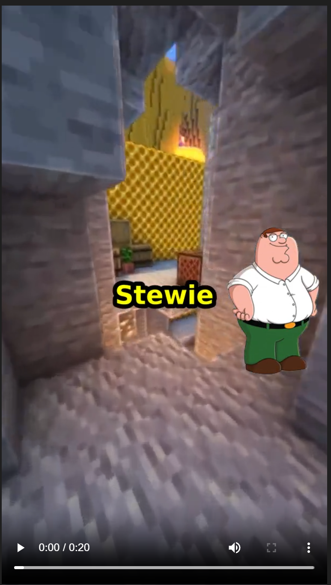

# brainrot video generator

generate absolute cinema right from your terminal. 



## the stars
here are our world-class actors:

<p align="center">
  
  
</p>

## what it is
a cli tool that takes a topic, asks open ai to write an unhinged debate between peter and stewie, grabs tts, and uses a cursed ffmpeg command to smash it all over minecraft parkour footage. 

words pop up one by one. characters slide in and furiously vibrate when they talk. peak 9:16 content.

## how to run
1. get assets: grab a 9:16 background video.
2. set your `OPENAI_API_KEY` in a `.env` file.
3. run the python magic:
```bash
source venv/bin/activate
pip install -r requirements.txt
python app.py --topic "pineapple on pizza" --bg "path/to/minecraft/parkour/video.mp4"
```

## license
mit. free to steal and get famous.
